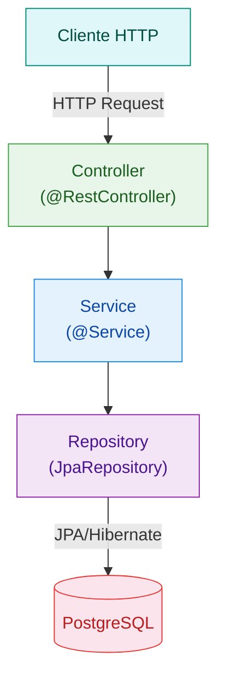
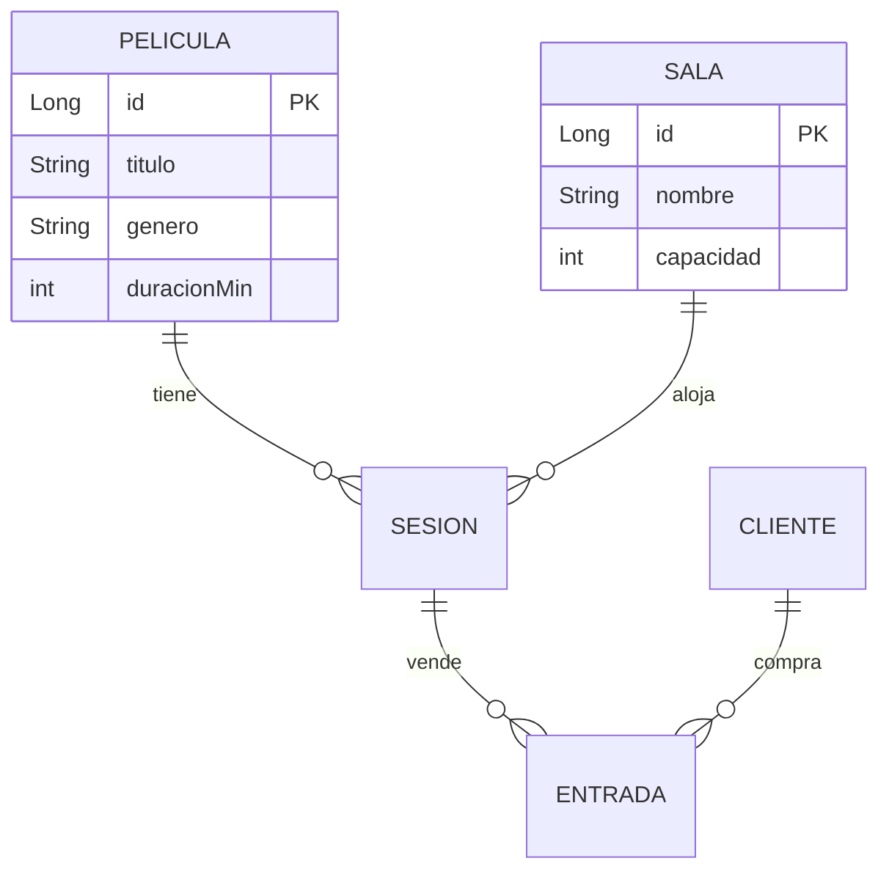

# Crear tu Repo de Portfolio

> *"El portfolio del backend NO es una URL publica, es un repo de GitHub
> que cualquiera puede levantar con un comando."*
>
> — Prof. Juan Marcelo Gutierrez Miranda

Tu fork del curso sirve para seguir los manuales y entregar el trabajo final.
Pero cuando termines el proyecto, vas a querer **mostrarlo en tu CV**.

Un recruiter no va a navegar `entregas/trabajo_final/garcia_pedro/` dentro de un fork
con 15 manuales y 16 blueprints. Necesitas un repo **limpio y profesional** que sea
100% tu proyecto.

Esta guia te explica como crearlo paso a paso.

### Importante: esto se construye poco a poco

NO tienes que hacer todo de golpe. El repo de portfolio se construye
a medida que avanzas en el curso:

| Dias | Que agregas al repo |
|------|---------------------|
| 13-14 | Crear el repo + codigo Spring Boot (entidades, controllers, servicios) |
| 15-16 | Dockerfile + docker-compose.yml |
| 17 | GitHub Actions (CI/CD) + badge en README |
| 18 | Swagger UI + pulir todo |
| 19 | README profesional + capturas + diagrama |

Si haces el curso por tu cuenta, sigue el mismo orden. Los manuales del curso
(en `manuales/`) explican cada tecnologia en detalle.

---

## El concepto: dos repos, dos propositos

```
github.com/TU_USUARIO/curso-spring-hibernate/     ← FORK (seguir el curso + entregar)
github.com/TU_USUARIO/cine-estrella/               ← TU PROYECTO (portfolio + CV)
```

| Repo | Para que | Quien lo ve |
|------|----------|-------------|
| Fork del curso | Manuales, ejercicios, entrega formal (PROMPTS.md, reflexion) | El profesor |
| Tu repo propio | Codigo profesional, Docker, Swagger, README bonito | Recruiters, GitHub, tu CV |

No se excluyen. Los dos conviven. Trabajas en tu repo propio y cuando toca entregar,
rellenas las plantillas en tu fork y enlazas tu repo.

---

## Paso 1: Crear el repositorio en GitHub

1. Ir a [github.com/new](https://github.com/new)
2. **Repository name:** el nombre de tu proyecto en minusculas con guiones
   - Ejemplo: `cine-estrella`, `vacunas-salud`, `agencia-viajes`
   - NO uses: `trabajo-final`, `proyecto-spring`, `mi-proyecto` (no dicen nada)
3. **Description:** una linea que diga que hace
   - Ejemplo: "API REST para gestion de un cine — Spring Boot 4 + PostgreSQL + Docker"
4. **Public** (marcado)
5. **Add a README file** (marcado)
6. **Add .gitignore:** seleccionar **Maven**
7. Click en **Create repository**

---

## Paso 2: Clonar en IntelliJ

```bash
cd DONDE_TENGAS_TUS_PROYECTOS
git clone https://github.com/TU_USUARIO/cine-estrella.git
```

En IntelliJ: **File → Open** → seleccionar la carpeta `cine-estrella`.

Ahora tienes dos proyectos en IntelliJ:

```
IntelliJ:
├── curso-spring-hibernate/     ← fork (manuales, consulta, entrega)
└── cine-estrella/              ← tu proyecto (aqui programas)
```

---

## Paso 3: Inicializar el proyecto Spring Boot

Hay dos formas:

### Opcion A: Spring Initializr (recomendado)

1. Ir a [start.spring.io](https://start.spring.io)
2. Configurar:
   - **Project:** Maven
   - **Language:** Java
   - **Spring Boot:** 4.0.x (la mas reciente estable)
   - **Group:** `com.tuusuario`
   - **Artifact:** `cine-estrella`
   - **Java:** 21
3. **Dependencies** (buscarlas en el buscador de la derecha):
   - **Spring Web** — para crear endpoints REST (`@RestController`, `@GetMapping`, etc.)
   - **Spring Data JPA** — para conectar con la base de datos usando `@Entity` y `JpaRepository`
   - **H2 Database** — base de datos en memoria para desarrollo (despues agregaras PostgreSQL para Docker)
   - **Lombok** — para no escribir getters/setters/constructores a mano (`@Data`, `@NoArgsConstructor`)
   - **Validation** — para validar datos de entrada (`@NotBlank`, `@Size`, `@Min`)
4. Click en **Generate** → descargar el ZIP
5. Descomprimir el contenido DENTRO de tu carpeta `cine-estrella/`

### Opcion B: Desde IntelliJ

1. **File → New → Project** → Spring Initializr
2. Misma configuracion que arriba
3. Ubicacion: la carpeta `cine-estrella/`

---

## Paso 4: Estructura del proyecto

Tu repo debe quedar asi:

```
cine-estrella/
├── README.md                        ← tu "landing page" profesional
├── docs/
│   └── screenshots/
│       ├── swagger-ui.png           ← captura de Swagger UI
│       ├── postman-crud.png         ← captura de Postman
│       └── adminer-tablas.png       ← captura de Adminer con datos
├── postman/
│   └── CineEstrella.postman_collection.json
├── src/
│   └── main/
│       ├── java/com/tuusuario/cineestrella/
│       │   ├── model/               ← @Entity
│       │   ├── repository/          ← JpaRepository
│       │   ├── service/             ← @Service
│       │   ├── controller/          ← @RestController
│       │   └── config/              ← OpenApiConfig (Swagger)
│       └── resources/
│           ├── application.properties
│           └── data.sql             ← datos iniciales
├── Dockerfile
├── docker-compose.yml
├── .github/
│   └── workflows/
│       └── build.yml                ← GitHub Actions CI
├── pom.xml
└── .gitignore
```

Carpetas clave que quiza no existan aun:

```bash
mkdir -p docs/screenshots
mkdir -p postman
mkdir -p .github/workflows
```

---

## Paso 5: El README profesional

Este es el archivo **mas importante** de tu repo. Es lo primero que ve cualquiera
que abra tu proyecto en GitHub.

Copia esta plantilla y rellena con los datos de tu proyecto.

**¿Que son los badges?** Son las etiquetas de colores que aparecen arriba del README
en muchos repos de GitHub (ej: "build passing" en verde). Se generan con URLs especiales
que apuntan a servicios como shields.io o a GitHub Actions. No necesitas entender la URL,
solo cambiar `TU_USUARIO` y `cine-estrella` por tus datos.

**¿Que es Mermaid?** Es un lenguaje de texto para dibujar diagramas. GitHub lo renderiza
automaticamente: escribes texto y GitHub muestra un diagrama visual. No necesitas instalar
nada ni generar imagenes — solo poner el codigo dentro de un bloque ` ```mermaid `.

```markdown
# Cine Estrella


> API REST para la gestion de un cine: peliculas, salas, sesiones y entradas.
> Construido con Spring Boot 4, Hibernate, PostgreSQL y Docker.

---

## Tecnologias

- Java 21, Maven
- Spring Boot 4 + Spring Data JPA + Hibernate 7
- PostgreSQL 16 (produccion) / H2 (desarrollo)
- Docker + Docker Compose
- GitHub Actions (CI/CD)
- Swagger UI (documentacion interactiva de la API)

---

## Como ejecutar

### Con Docker (recomendado)

```bash
docker compose up
```

- API: http://localhost:8080
- Swagger UI: http://localhost:8080/swagger-ui.html
- Adminer: http://localhost:8081

### Sin Docker (desarrollo local)

```bash
mvn spring-boot:run
```

Usa H2 en memoria. Swagger UI en http://localhost:8080/swagger-ui.html

---

## Endpoints principales

| Metodo | Endpoint | Descripcion |
|--------|----------|-------------|
| GET | `/api/peliculas` | Listar todas las peliculas |
| POST | `/api/peliculas` | Crear nueva pelicula |
| GET | `/api/peliculas/{id}` | Obtener pelicula por ID |
| PUT | `/api/peliculas/{id}` | Actualizar pelicula |
| DELETE | `/api/peliculas/{id}` | Eliminar pelicula |
| GET | `/api/salas` | Listar salas |
| GET | `/api/sesiones/pelicula/{id}` | Sesiones de una pelicula |

---

## Swagger UI

Documentacion interactiva generada automaticamente. Permite probar
todos los endpoints desde el navegador sin necesidad de Postman.


---

## Arquitectura



## Diagrama de entidades



---

## Capturas

### Postman — CRUD funcionando


### Adminer — Base de datos con datos


---

## Estructura del proyecto

```
src/main/java/com/tuusuario/cineestrella/
├── model/           ← Entidades JPA (@Entity)
├── repository/      ← Interfaces JpaRepository
├── service/         ← Logica de negocio (@Service)
├── controller/      ← Endpoints REST (@RestController)
└── config/          ← Configuracion (Swagger)
```
```

---

## Paso 6: Swagger UI — Tu "dashboard" visual

**¿Que es Swagger UI?** Es una pagina web que se genera **automaticamente** dentro
de tu aplicacion Spring Boot. No escribes HTML ni JavaScript. Agregas una dependencia
Maven y la libreria lee tus anotaciones de Spring (`@GetMapping`, `@PostMapping`, etc.)
para generar una interfaz donde puedes VER y PROBAR todos tus endpoints desde el navegador.

Es como Postman, pero integrado en tu app y accesible desde cualquier navegador.
Para un proyecto de backend, es lo mas parecido a un "frontend" sin hacer frontend.

### Agregar la dependencia

En `pom.xml`, dentro de `<dependencies>`:

```xml
<dependency>
    <groupId>org.springdoc</groupId>
    <artifactId>springdoc-openapi-starter-webmvc-ui</artifactId>
    <version>2.8.6</version>
</dependency>
```

Despues de agregar la dependencia, refrescar Maven en IntelliJ (icono de recarga)
o ejecutar `mvn clean compile`.

### Verificar que funciona

1. Ejecutar la app (`Run` en IntelliJ o `mvn spring-boot:run`)
2. Abrir en el navegador: `http://localhost:8080/swagger-ui.html`
3. Deben aparecer todos los controllers con sus endpoints
4. Click en cualquier endpoint → **Try it out** → **Execute** → ven la respuesta

Si aparece un 404, verificar que la dependencia se descargo bien (refrescar Maven).

### Configurar titulo y descripcion (opcional pero recomendado)

Esto hace que Swagger UI muestre el nombre de TU proyecto en vez de un titulo generico.

Crear el archivo `src/main/java/com/tuusuario/cineestrella/config/OpenApiConfig.java`:

```java
package com.tuusuario.cineestrella.config;

import io.swagger.v3.oas.models.OpenAPI;
import io.swagger.v3.oas.models.info.Contact;
import io.swagger.v3.oas.models.info.Info;
import org.springframework.context.annotation.Bean;
import org.springframework.context.annotation.Configuration;

@Configuration  // Le dice a Spring que esta clase contiene configuracion
public class OpenApiConfig {

    @Bean  // Le dice a Spring que este metodo crea un objeto que Spring debe gestionar
    public OpenAPI customOpenAPI() {
        return new OpenAPI()
            .info(new Info()
                .title("Cine Estrella API")                          // Cambiar por tu proyecto
                .description("API REST para gestion de peliculas, salas y entradas")
                .version("1.0.0")
                .contact(new Contact()
                    .name("Tu Nombre")                               // Tu nombre real
                    .url("https://github.com/TU_USUARIO/cine-estrella")));  // Tu repo
    }
}
```

### Resultado

Con la app corriendo, abrir: `http://localhost:8080/swagger-ui.html`

Todos los endpoints aparecen organizados por controller, con colores por metodo HTTP
(GET=verde, POST=azul, PUT=naranja, DELETE=rojo). Cada uno tiene un boton
"Try it out" para probar la peticion directamente desde el navegador.

**Hacer captura de pantalla** y guardarla en `docs/screenshots/swagger-ui.png`.

---

## Paso 7: Screenshots — Hacer visible lo invisible

Estas capturas van en `docs/screenshots/` y se incrustan en el README.
Son lo que un recruiter VE sin clonar ni ejecutar nada.

### Como hacer capturas en Windows

- **Win + Shift + S** → seleccionar el area → se copia al portapapeles
- Abrir Paint o cualquier editor → Pegar (Ctrl+V) → Guardar como PNG
- Guardar directamente en `docs/screenshots/` dentro de tu proyecto

### Que capturar

| Captura | Que mostrar | Nombre del archivo |
|---------|-------------|-------------------|
| **Swagger UI** | La pagina con todos los endpoints listados | `swagger-ui.png` |
| **Postman** | Un GET que devuelve datos + un POST creando algo | `postman-crud.png` |
| **Adminer** | La vista de tablas con datos cargados | `adminer-tablas.png` |
| **GitHub Actions** | El pipeline verde (check verde en la pestaña Actions) | `github-actions.png` |

### Como incrustar en el README

```markdown

```

GitHub renderiza las imagenes directamente. El recruiter abre tu repo y las VE
sin hacer nada.

---

## Paso 8: GitHub Actions — El badge verde

**¿Que es GitHub Actions?** Es un servicio gratuito de GitHub que ejecuta comandos
automaticamente cada vez que haces push. Lo mas comun: compilar tu proyecto y correr
los tests. Si todo pasa, aparece un check verde en tu repo. Si algo falla, aparece
una X roja. El badge en el README muestra ese estado en tiempo real.

En la practica: haces push → GitHub descarga tu codigo en un servidor Linux →
ejecuta `mvn package` → si compila y los tests pasan → badge verde.

Crear `.github/workflows/build.yml`:

```yaml
name: Build

on:
  push:
    branches: [ main ]
  pull_request:
    branches: [ main ]

jobs:
  build:
    runs-on: ubuntu-latest

    steps:
    - uses: actions/checkout@v4

    - name: Set up JDK 21
      uses: actions/setup-java@v4
      with:
        java-version: '21'
        distribution: 'temurin'

    - name: Build with Maven
      run: mvn -B package --file pom.xml
```

Despues de hacer push, ir a la pestaña **Actions** en GitHub para ver que pasa.
Cuando este verde, el badge del README se actualiza automaticamente.

---

## Paso 9: Docker — Que cualquiera pueda ejecutar tu proyecto

**¿Que es Docker?** Es una herramienta que empaqueta tu aplicacion con TODO lo que
necesita (Java, dependencias, configuracion) en un "contenedor". Cualquiera que tenga
Docker instalado puede ejecutar tu app con un solo comando, sin instalar Java, Maven,
ni bases de datos.

**¿Que es Docker Compose?** Es una extension de Docker que permite levantar VARIOS
contenedores a la vez. En tu caso: tu app Spring Boot + una base de datos PostgreSQL +
Adminer (una interfaz web para ver la base de datos). Todo con un solo comando.

### Agregar dependencia de PostgreSQL

Cuando tu app corre en Docker, usa PostgreSQL en vez de H2. Agrega en `pom.xml`:

```xml
<dependency>
    <groupId>org.postgresql</groupId>
    <artifactId>postgresql</artifactId>
    <scope>runtime</scope>
</dependency>
```

### Crear el Dockerfile

El `Dockerfile` le dice a Docker como construir el contenedor de tu app.
Crear el archivo `Dockerfile` en la raiz del proyecto (junto al `pom.xml`):

```dockerfile
# Etapa 1: compilar el proyecto con Maven
FROM eclipse-temurin:21-jdk AS build
WORKDIR /app
COPY pom.xml .
COPY src ./src
RUN apt-get update && apt-get install -y maven
RUN mvn clean package -DskipTests

# Etapa 2: ejecutar solo el JAR compilado
FROM eclipse-temurin:21-jre
WORKDIR /app
COPY --from=build /app/target/*.jar app.jar
EXPOSE 8080
ENTRYPOINT ["java", "-jar", "app.jar"]
```

**¿Que hace esto?** Primero compila tu proyecto con Maven (etapa 1).
Despues copia solo el JAR resultante a un contenedor ligero (etapa 2).
Asi el contenedor final es pequeno y rapido.

### Crear el docker-compose.yml

Crear `docker-compose.yml` en la raiz del proyecto:

```yaml
services:
  db:
    image: postgres:16-alpine
    environment:
      POSTGRES_DB: mi_proyecto
      POSTGRES_USER: postgres
      POSTGRES_PASSWORD: postgres
    ports:
      - "5432:5432"
    healthcheck:
      test: ["CMD-SHELL", "pg_isready -U postgres"]
      interval: 5s
      timeout: 3s
      retries: 5

  adminer:
    image: adminer:latest
    ports:
      - "8081:8080"
    depends_on:
      - db

  app:
    build: .
    ports:
      - "8080:8080"
    environment:
      SPRING_DATASOURCE_URL: jdbc:postgresql://db:5432/mi_proyecto
      SPRING_DATASOURCE_USERNAME: postgres
      SPRING_DATASOURCE_PASSWORD: postgres
      SPRING_JPA_HIBERNATE_DDL_AUTO: update
    depends_on:
      db:
        condition: service_healthy
```

### ¿Como sabe la app si usar H2 o PostgreSQL?

- **Cuando ejecutas localmente** (`mvn spring-boot:run`): usa H2 en memoria
  (configurado en `application.properties`)
- **Cuando ejecutas con Docker** (`docker compose up`): las variables de entorno
  del `docker-compose.yml` sobreescriben la configuracion y apuntan a PostgreSQL

No necesitas dos archivos de configuracion. Docker Compose se encarga.

### Verificar que funciona

```bash
docker compose up --build
```

- API: http://localhost:8080/api/...
- Swagger UI: http://localhost:8080/swagger-ui.html
- Adminer: http://localhost:8081 (servidor: `db`, usuario: `postgres`, password: `postgres`)

Si todo arranca, hacer captura de Adminer y guardarla en `docs/screenshots/adminer-tablas.png`.

---

## Paso 10: Coleccion Postman

**¿Que es una coleccion Postman?** Es un archivo JSON que contiene todas las peticiones
HTTP que has probado en Postman (GET, POST, PUT, DELETE). Al exportarla y subirla al repo,
cualquiera puede importarla en su Postman y probar tu API sin tener que escribir las
peticiones desde cero.

Exportar tu coleccion:

1. En Postman: click derecho en tu coleccion → **Export**
2. Formato: **Collection v2.1**
3. Guardar como `postman/CineEstrella.postman_collection.json`
4. Commit y push

---

## Paso 11: Conectar con la entrega del curso

Tu proyecto ya esta en su propio repo. Ahora hay que conectarlo con la entrega
formal en tu fork del curso.

1. En tu fork de `curso-spring-hibernate`, copia la plantilla a tu promocion:
   ```bash
   cp -r trabajo_final/plantilla/ entregas/trabajo_final/2026-T1/apellido_nombre/
   ```
   (Si haces el curso por tu cuenta, usa `comunidad/` en vez de `2026-T1/`)

2. Rellena las plantillas como siempre (PROMPTS.md, reflexion, respuestas)

3. En el archivo `REPO_PROYECTO.md`, pon el enlace a tu repo:
   ```markdown
   **Repo:** https://github.com/TU_USUARIO/cine-estrella
   ```

4. Commit y push a tu fork

El profesor revisa tu fork para la evaluacion formal (bloques A-D) y
tu repo propio para verificar que el proyecto funciona.

---

## Checklist final

Antes de considerar tu repo de portfolio terminado:

### Obligatorio

- [ ] README con descripcion, tecnologias, como ejecutar y endpoints
- [ ] Swagger UI funcionando en `/swagger-ui.html`
- [ ] `docker compose up` levanta app + base de datos sin errores
- [ ] GitHub Actions: pipeline verde, badge visible en README
- [ ] `.gitignore` correcto (sin `target/`, `.idea/`, `.env`)

### Recomendado

- [ ] Capturas de Swagger UI y Postman incrustadas en README
- [ ] Diagrama de arquitectura en Mermaid (GitHub lo renderiza)
- [ ] Diagrama de entidades (ER) en Mermaid
- [ ] OpenApiConfig con titulo y descripcion del proyecto
- [ ] Coleccion Postman exportada en `postman/`
- [ ] 10+ commits con mensajes descriptivos

### Bonus

- [ ] Captura de Adminer mostrando las tablas con datos
- [ ] Captura de GitHub Actions (pipeline verde)
- [ ] Tests JUnit que pasen

---

## "Pero si es backend... ¿donde lo veo funcionando?"

Esta es la pregunta mas comun. Y la respuesta honesta es:
**no lo ves corriendo en internet.** Y eso esta bien.

Un proyecto de frontend se despliega en Vercel y tienes una URL publica.
Un dashboard de datos se sube a Streamlit o Tableau Public. Pero un backend
no tiene interfaz grafica por naturaleza — es una API que responde JSON.

### ¿Entonces como demuestra un developer backend que su proyecto funciona?

Con **evidencia verificable** en el repo:

```
╔═══════════════════════════════════════════════════════════════════╗
║  ¿COMO SE "VE" UN PROYECTO BACKEND SIN SERVIDOR PUBLICO?         ║
╠═══════════════════════════════════════════════════════════════════╣
║                                                                   ║
║  1. docker compose up                                             ║
║     → Cualquiera que clone el repo puede levantar TODO            ║
║       en su maquina con UN comando. No necesita instalar          ║
║       Java, Maven, ni PostgreSQL. Solo Docker.                    ║
║                                                                   ║
║  2. Swagger UI (capturas en el README)                            ║
║     → El recruiter VE la interfaz de la API sin ejecutar nada.    ║
║       Es visual: endpoints con colores, botones, ejemplos.        ║
║       Es la prueba de que la API existe y esta documentada.       ║
║                                                                   ║
║  3. Badge verde de GitHub Actions                                 ║
║     → Prueba automatica de que el codigo compila y los tests      ║
║       pasan. Cada vez que haces push, GitHub lo verifica.         ║
║       Verde = funciona. Nadie lo puede falsificar.                ║
║                                                                   ║
║  4. Capturas de Postman / Adminer                                 ║
║     → Screenshots reales de peticiones HTTP con respuestas JSON,  ║
║       y de la base de datos con tablas y datos cargados.          ║
║       Evidencia concreta de que los endpoints funcionan.          ║
║                                                                   ║
║  5. Coleccion Postman exportada                                   ║
║     → Un archivo .json que el recruiter importa en Postman y      ║
║       prueba TODOS los endpoints en 30 segundos.                  ║
║                                                                   ║
╚═══════════════════════════════════════════════════════════════════╝
```

### Comparativa con otros perfiles

| Perfil | Como muestra su trabajo | Equivalente en backend |
|--------|------------------------|----------------------|
| Frontend | URL publica (Vercel, Netlify) | `docker compose up` + Swagger UI |
| Data / BI | Dashboard interactivo (Tableau, PowerBI) | Capturas de Swagger + Adminer |
| DevOps | Pipeline visible en CI/CD | Badge verde de GitHub Actions |
| Backend | **Todo lo anterior junto** | README + Docker + Swagger + Badge + Postman |

### ¿Y si alguien quiere verlo corriendo de verdad?

Tiene dos opciones:

1. **Clonar + Docker** (30 segundos):
   ```bash
   git clone https://github.com/TU_USUARIO/cine-estrella.git
   cd cine-estrella
   docker compose up
   # Abrir http://localhost:8080/swagger-ui.html
   ```

2. **Importar coleccion Postman** (10 segundos):
   Descargar el `.json` de la carpeta `postman/` → importar en Postman → ejecutar.

En la industria, un recruiter tecnico de backend SABE que las APIs no tienen
interfaz grafica. Lo que busca es: ¿este candidato sabe empaquetar y documentar
su trabajo para que OTRO lo pueda ejecutar sin pedirle ayuda? Si la respuesta
es si, el candidato demuestra que sabe trabajar en equipo y en produccion.

### ¿Se puede desplegar gratis en internet?

Si, pero queda fuera del alcance de este curso. Si quieres hacerlo por tu cuenta:

| Servicio | Que ofrece gratis | Limitacion |
|----------|-------------------|------------|
| [Railway](https://railway.app) | App + PostgreSQL | 500 horas/mes, se apaga si no se usa |
| [Render](https://render.com) | App + PostgreSQL | Se duerme a los 15 min sin uso |
| [Fly.io](https://fly.io) | Contenedor Docker | 3 maquinas pequeñas gratis |

Estos servicios son utiles para tener una URL publica temporal, pero no son
necesarios para el portfolio. El repo de GitHub con Docker + Swagger + badge
es suficiente para demostrar competencia profesional.

---

## Por que importa

Un recruiter de backend abre tu repo en GitHub. No va a clonar (al menos no de entrada).
Lo que hace en 60 segundos:

```
1. Lee el README
   → ¿Tiene descripcion clara? ¿Badges? ¿Diagramas?
   → Si dice "Spring Boot project generated by Spring Initializr" → cierra la pestaña

2. Mira las capturas
   → ¿Swagger UI? ¿Datos reales? ¿Postman?
   → Si no hay capturas, no hay evidencia de que funcione

3. Mira el badge de CI
   → ¿Verde? = este candidato sabe configurar un pipeline
   → ¿Rojo o no hay? = no sabe o no le importa

4. Si le interesa, clona y ejecuta
   → docker compose up → ¿arranca? → abre Swagger UI → prueba un endpoint
   → Si funciona a la primera: "este candidato sabe lo que hace"

5. Decide en < 3 minutos
   → "Este candidato sabe montar un backend completo y desplegable"
```

Tu repo de portfolio es tu carta de presentacion profesional. No es un ejercicio
de clase. Es lo que queda en tu GitHub para siempre.

---

## Resumen visual

```
╔═══════════════════════════════════════════════════════════════╗
║                    TUS DOS REPOS                              ║
╠═══════════════════════════════════════════════════════════════╣
║                                                               ║
║  FORK del curso                    TU REPO PROPIO             ║
║  ──────────────                    ──────────────             ║
║  curso-spring-hibernate/           cine-estrella/             ║
║                                                               ║
║  ├── manuales/ (consulta)          ├── README.md (pro)        ║
║  ├── blueprints/ (referencia)      ├── docs/screenshots/      ║
║  └── entregas/                     ├── postman/               ║
║      └── trabajo_final/            ├── src/ (tu codigo)       ║
║          └── 2026-T1/tu_nombre/    ├── Dockerfile             ║
║              ├── PROMPTS.md        ├── docker-compose.yml     ║
║              ├── 01-05 docs        ├── .github/workflows/     ║
║              └── REPO_PROYECTO.md  └── pom.xml                ║
║                    │                       ▲                  ║
║                    └── enlaza a ───────────┘                  ║
║                                                               ║
║  Para: evaluacion                  Para: portfolio + CV       ║
║  Ve: el profesor                   Ve: recruiters + GitHub    ║
║                                                               ║
╚═══════════════════════════════════════════════════════════════╝
```

---

-------------------------
Referencia: @TodoEconometria
Profesor: Juan Marcelo Gutierrez Miranda
Hash ID: 7a3f1b9c4d8e2f5a6b0c9d8e7f1a2b3c4d5e6f7a8b9c0d1e2f3a4b5c6d7e8f9a
-------------------------
