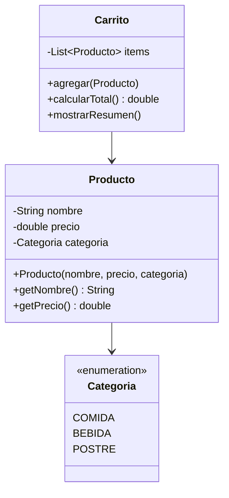

# Dia 2: Programacion Orientada a Objetos - Fundamentos

**Curso IFCD0014 -- Semana 1, Dia 2**

---

## Objetivos del dia

- Entender la diferencia entre clase (plano) y objeto (instancia)
- Crear clases con atributos privados, constructores y getters/setters
- Aplicar encapsulamiento para proteger el estado interno de un objeto
- Usar miembros `static` y tipos `enum`
- Componer objetos: un objeto que contiene otros objetos

## Conceptos clave

Una clase es un molde que define atributos (datos) y metodos (comportamiento). Un objeto es una instancia concreta de esa clase en memoria. El encapsulamiento consiste en declarar los atributos como `private` y exponer metodos publicos (`getters` y `setters`) para controlar el acceso.

Los constructores inicializan el estado del objeto al crearlo con `new`. Java permite sobrecarga de constructores (mismo nombre, distintos parametros). La palabra `this` referencia al objeto actual y resuelve ambiguedades entre atributos y parametros.

Los miembros `static` pertenecen a la clase, no a la instancia. Un `enum` define un conjunto fijo de constantes con nombre (por ejemplo: `PEQUENA`, `MEDIANA`, `GRANDE`), mas seguro y legible que usar Strings o enteros.

## Que vas a construir

Un sistema de modelos con clases `Producto`, `Cliente` y `Carrito`. El producto tiene nombre, precio y categoria (enum). El carrito contiene una lista de productos y calcula el total.

## Arquitectura sugerida

## Ejercicios

1. Crear la clase `Producto` con atributos privados, constructor, getters y `toString()`
2. Definir el enum `Categoria` con valores COMIDA, BEBIDA, POSTRE y un metodo que devuelva la descripcion
3. Crear la clase `Carrito` que almacene productos en un `ArrayList` y calcule el total
4. Agregar un contador `static` en `Producto` que lleve la cuenta de cuantos productos se han creado
5. Crear un `main()` que instancie varios productos, los agregue al carrito y muestre el resumen

## Verificacion

- [ ] Los atributos son `private` y solo se acceden via getters/setters
- [ ] El constructor inicializa todos los atributos obligatorios
- [ ] El enum `Categoria` se usa en vez de Strings para las categorias
- [ ] El carrito calcula correctamente el total de los productos
- [ ] El contador `static` incrementa con cada nuevo `Producto`

## Profundiza con el libro

En *Arquitectura de Sistemas Enterprise* de @TodoEconometria, el capitulo "POO como base de la arquitectura" muestra por que el encapsulamiento y la composicion de objetos son la base sobre la que se construyen los patrones de Spring.

---
Curso IFCD0014 | Prof. Juan Marcelo Gutierrez Miranda | @TodoEconometria
