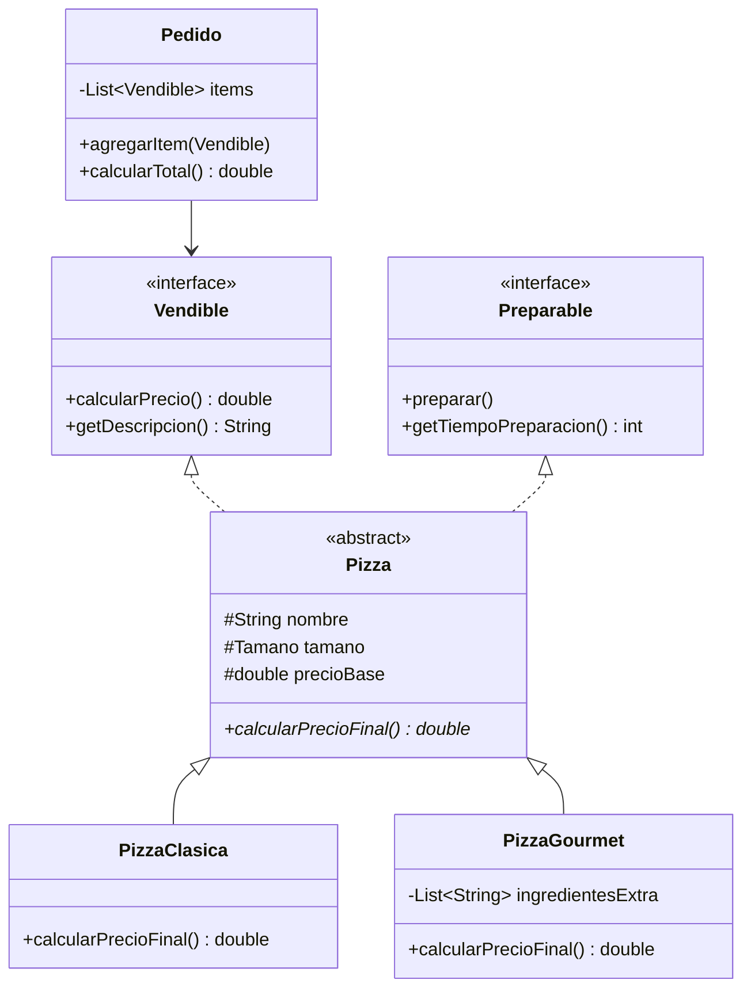

# Dia 3: Pizzeria v1 - Interfaces, Herencia y Polimorfismo

**Curso IFCD0014 -- Semana 1, Dia 3**

---

## Objetivos del dia

- Definir interfaces como contratos de comportamiento (`Vendible`, `Preparable`)
- Crear clases abstractas que comparten logica comun (`Pizza`)
- Aplicar herencia para especializar comportamiento (`PizzaClasica`, `PizzaGourmet`)
- Entender polimorfismo: tratar distintos tipos a traves de una interfaz comun
- Construir un `Pedido` que trabaje con `List<Vendible>`

## Conceptos clave

Una interfaz define QUE debe hacer una clase, sin decir COMO. `Vendible` declara `calcularPrecio()` y `getDescripcion()`. Cualquier clase que implemente `Vendible` puede venderse en el sistema, sean pizzas, bebidas o complementos.

Una clase abstracta como `Pizza` implementa parte de la logica (nombre, tamano, precio base) pero deja metodos abstractos (`calcularPrecioFinal()`) para que las subclases los definan. `PizzaClasica` calcula el precio de una forma, `PizzaGourmet` de otra.

El polimorfismo permite que `Pedido` trabaje con `List<Vendible>` sin saber los tipos concretos. Esto es la base del principio "programar contra interfaces", que veras repetido en Spring con `@Service` e inyeccion de dependencias.

## Que vas a construir

La primera version de la Pizzeria: un sistema donde se crean pizzas de distintos tipos, se agregan a un pedido junto con bebidas y complementos, y el pedido calcula el total aprovechando que todos implementan `Vendible`.

## Arquitectura sugerida

## Ejercicios

1. Crear las interfaces `Vendible` (con `calcularPrecio()` y `getDescripcion()`) y `Preparable` (con `preparar()` y `getTiempoPreparacion()`)
2. Implementar la clase abstracta `Pizza` que implemente ambas interfaces, con un enum `Tamano` (PEQUENA, MEDIANA, GRANDE)
3. Crear `PizzaClasica` (precio = base * factor tamano) y `PizzaGourmet` (precio = base + extras * 1.5)
4. Crear `Bebida` y `Complemento` que implementen `Vendible` (no `Preparable`)
5. Implementar `Pedido` con `List<Vendible>`, metodo `calcularTotal()` y `mostrarTicket()`

## Verificacion

- [ ] `PizzaClasica` y `PizzaGourmet` extienden `Pizza` e implementan el calculo de precio diferente
- [ ] `Pedido` acepta cualquier `Vendible` (pizzas, bebidas, complementos)
- [ ] `mostrarTicket()` recorre la lista e imprime la descripcion y precio de cada item
- [ ] No se puede instanciar `Pizza` directamente (es abstracta)
- [ ] El polimorfismo funciona: un bucle `for(Vendible v : items)` llama al metodo correcto de cada tipo

## Profundiza con el libro

El capitulo "De la OOP al Enterprise" en *Arquitectura de Sistemas Enterprise* de @TodoEconometria explica como las interfaces de la Pizzeria son exactamente el mismo patron que Spring usa con `@Service` y `@Repository`. Lo que hoy haces con `Vendible`, manana lo haras con `JpaRepository<T, ID>`.

---
Curso IFCD0014 | Prof. Juan Marcelo Gutierrez Miranda | @TodoEconometria
