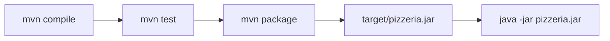

# Dia 6: Maven Avanzado y Streams en Profundidad

**Curso IFCD0014 -- Semana 2, Dia 6**

---

## Objetivos del dia

- Dominar el ciclo de vida de Maven (clean, compile, test, package, install)
- Configurar plugins esenciales: compiler, surefire, jar
- Construir pipelines de Streams complejos con operaciones intermedias y terminales
- Aplicar el GPS Arquitectonico: ubicar cada clase en la capa correcta
- Resolver problemas reales combinando Maven y Streams

## Conceptos clave

Maven tiene un ciclo de vida con fases secuenciales: `validate` > `compile` > `test` > `package` > `install` > `deploy`. Cuando ejecutas `mvn package`, Maven ejecuta todas las fases anteriores automaticamente. Los plugins extienden este ciclo: `maven-compiler-plugin` configura la version de Java, `maven-surefire-plugin` ejecuta los tests.

Los Streams tienen operaciones intermedias (devuelven otro Stream: `filter`, `map`, `sorted`, `distinct`) y operaciones terminales (producen un resultado: `collect`, `forEach`, `reduce`, `count`). Un Stream se procesa de forma lazy: las operaciones intermedias no se ejecutan hasta que hay una terminal.

El GPS Arquitectonico es una regla mental: antes de escribir una clase, preguntate en que capa va. Si tiene `@Entity` o atributos de datos, va en `modelo`. Si accede a datos, `repositorio`. Si tiene logica de negocio, `servicio`. Esta disciplina previene el "codigo espagueti".

## Que vas a construir

Pipelines de Streams aplicados a la Pizzeria: filtrar pizzas por precio, agrupar pedidos por cliente, generar reportes con `Collectors.groupingBy()` y estadisticas con `DoubleSummaryStatistics`.

## Arquitectura sugerida

## Ejercicios

1. Configurar `maven-compiler-plugin` para Java 21 en el `pom.xml`
2. Ejecutar `mvn clean package` y verificar que genera el JAR correctamente
3. Implementar un pipeline que filtre pizzas con precio > 10, las ordene por precio y las colecte en una nueva lista
4. Usar `Collectors.groupingBy()` para agrupar pedidos por fecha o por cliente
5. Generar un reporte con `DoubleSummaryStatistics` que muestre: total de ventas, promedio, pizza mas cara y mas barata

## Verificacion

- [ ] `mvn clean package` se ejecuta sin errores ni warnings
- [ ] El plugin compiler esta configurado para Java 21
- [ ] Los pipelines de Streams producen los resultados esperados
- [ ] Se usa `Collectors.groupingBy()` para al menos una agrupacion
- [ ] Cada clase del proyecto esta en el paquete correcto segun el GPS Arquitectonico

## Profundiza con el libro

El capitulo "Streams y procesamiento funcional" en *Arquitectura de Sistemas Enterprise* de @TodoEconometria muestra como los mismos patrones de Streams que usas aqui aparecen en Spring (procesamiento de listas de entidades, transformacion de DTOs, etc.).

---
Curso IFCD0014 | Prof. Juan Marcelo Gutierrez Miranda | @TodoEconometria
