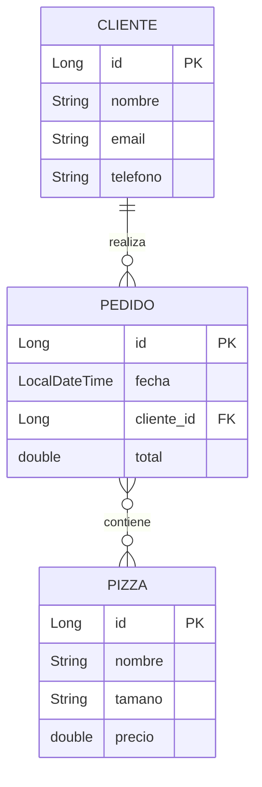

# Dia 10: Pizzeria con Hibernate - Relaciones y Persistencia

**Curso IFCD0014 -- Semana 2, Dia 10**

---

## Objetivos del dia

- Mapear las entidades de la Pizzeria como `@Entity` con JPA
- Implementar relaciones `@ManyToOne`, `@OneToMany` y `@ManyToMany`
- Configurar `@JoinTable` para relaciones muchos-a-muchos
- Crear repositorios que usen `EntityManager` para persistir datos
- Migrar la Pizzeria de `HashMap` en memoria a H2 con Hibernate

## Conceptos clave

Las relaciones entre entidades JPA replican las relaciones del modelo de datos. Un `Pedido` pertenece a un `Cliente` (`@ManyToOne`): muchos pedidos pueden ser del mismo cliente. Un `Pedido` contiene muchas `Pizza` y una `Pizza` puede estar en muchos pedidos (`@ManyToMany`), lo que requiere una tabla intermedia configurada con `@JoinTable`.

El cascade (`CascadeType.PERSIST`, `CascadeType.ALL`) define que operaciones se propagan: si guardas un `Pedido` con cascade, sus `Pizza` se guardan automaticamente. El fetch (`FetchType.LAZY` vs `EAGER`) controla cuando se cargan las relaciones: LAZY las carga solo cuando las accedes, EAGER las carga inmediatamente.

Esta version de la Pizzeria (v5) reemplaza los `HashMap` por tablas reales en H2. Los repositorios ahora usan `EntityManager` en vez de colecciones en memoria, pero la interfaz del servicio no cambia. Esa es la potencia del patron Repository.

## Que vas a construir

Pizzeria v5: las entidades `Pizza`, `Cliente` y `Pedido` se persisten en H2 con Hibernate. Se pueden crear clientes, hacer pedidos con multiples pizzas y consultar el historial.

## Arquitectura sugerida

## Ejercicios

1. Crear la entidad `Cliente` con `@Entity`, `@Id`, `@GeneratedValue` y atributos: nombre, email, telefono
2. Crear la entidad `Pedido` con `@ManyToOne` hacia `Cliente` y `@ManyToMany` hacia `Pizza`
3. Configurar `@JoinTable(name = "pedido_pizza")` en la relacion ManyToMany
4. Implementar `ClienteRepository` y `PedidoRepository` usando `EntityManager`
5. Crear un programa que registre un cliente, cree un pedido con 3 pizzas y lo persista en H2

## Verificacion

- [ ] Hibernate genera las tablas CLIENTE, PEDIDO, PIZZA y PEDIDO_PIZZA automaticamente
- [ ] Al guardar un pedido con cascade, las pizzas se persisten automaticamente
- [ ] Se puede consultar un cliente y obtener sus pedidos (navegacion de la relacion)
- [ ] JPQL permite buscar pedidos por cliente: `SELECT p FROM Pedido p WHERE p.cliente.nombre = :nombre`
- [ ] La consola H2 muestra los datos en las tablas (http://localhost:8082)

## Profundiza con el libro

El capitulo "Relaciones JPA en la practica" de *Arquitectura de Sistemas Enterprise* de @TodoEconometria detalla las trampas comunes: el problema N+1, cuando usar LAZY vs EAGER, y como `@JoinTable` se traduce a SQL. Tambien explica por que esta Pizzeria v5 se migra a Spring Data JPA en solo 20 minutos (dia 12).

---
Curso IFCD0014 | Prof. Juan Marcelo Gutierrez Miranda | @TodoEconometria
