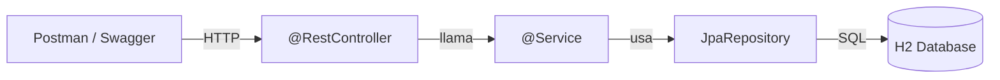

# Dia 11: Spring Boot - Tu Primera API REST

**Curso IFCD0014 -- Semana 3, Dia 11**

---

## Objetivos del dia

- Entender Inversion de Control (IoC) e Inyeccion de Dependencias (DI) de Spring
- Crear un proyecto con Spring Initializr (start.spring.io)
- Usar Lombok para reducir codigo repetitivo (@Data, @Builder, @NoArgsConstructor)
- Configurar `application.properties` para H2 y Swagger
- Crear tu primer `@RestController` con operaciones CRUD

## Conceptos clave

Spring Boot automatiza lo que hiciste manualmente en el dia 4. En vez de instanciar repositorios y pasarlos por constructor, Spring los detecta (`@Repository`), los crea y los inyecta (`@Autowired` o inyeccion por constructor). Esto es IoC: tu no controlas la creacion de objetos, Spring lo hace.

Spring Initializr genera un proyecto preconfigurado. Las dependencias se eligen como "starters": `spring-boot-starter-web` para REST, `spring-boot-starter-data-jpa` para JPA, `h2` para la base de datos, `lombok` para reducir boilerplate. Todo listo para ejecutar con `mvn spring-boot:run`.

Lombok genera automaticamente getters, setters, constructores, `toString()`, `equals()` y `hashCode()` a partir de anotaciones. `@Data` genera todo. `@Builder` permite crear objetos con patron builder. Esto reduce cientos de lineas de codigo repetitivo.

## Que vas a construir

Una API REST de Libros con Spring Boot: un `@RestController` que exponga endpoints GET, POST, PUT y DELETE, conectado a H2 a traves de un `JpaRepository`, documentado con Swagger UI.

## Arquitectura sugerida

## Ejercicios

1. Crear un proyecto en start.spring.io con: Web, JPA, H2, Lombok, DevTools
2. Crear la entidad `Libro` con `@Entity`, `@Data`, `@Builder` y atributos: titulo, autor, precio, isbn
3. Crear `LibroRepository` extendiendo `JpaRepository<Libro, Long>` (sin implementacion, Spring la genera)
4. Crear `LibroService` con `@Service` que use el repositorio para CRUD
5. Crear `LibroController` con `@RestController` y endpoints: GET /api/libros, GET /api/libros/{id}, POST, PUT, DELETE

## Verificacion

- [ ] `mvn spring-boot:run` inicia la aplicacion sin errores en el puerto 8080
- [ ] Swagger UI muestra todos los endpoints en http://localhost:8080/swagger-ui.html
- [ ] POST /api/libros crea un libro y devuelve 201
- [ ] GET /api/libros devuelve la lista de libros en JSON
- [ ] DELETE /api/libros/{id} elimina el libro y devuelve 204

## Profundiza con el libro

En *Arquitectura de Sistemas Enterprise* de @TodoEconometria, el capitulo "Spring Boot: de cero a API REST" explica el contexto de aplicacion de Spring, como funciona el autoconfiguration, y la relacion entre `@Component`, `@Service`, `@Repository` y `@Controller`.

---
Curso IFCD0014 | Prof. Juan Marcelo Gutierrez Miranda | @TodoEconometria
