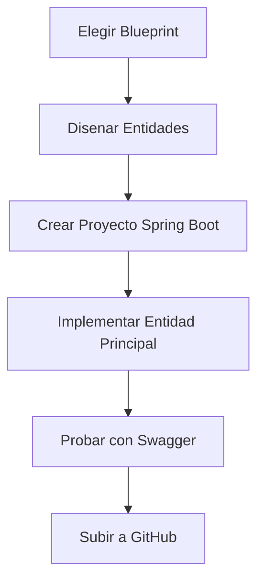

# Dia 13: Proyecto Personal - Diseno y Primer CRUD

**Curso IFCD0014 -- Semana 3, Dia 13**

---

## Objetivos del dia

- Elegir un dominio de proyecto entre los 16 blueprints disponibles
- Disenar el modelo de datos con al menos 3 entidades relacionadas
- Crear el proyecto Spring Boot desde Spring Initializr
- Implementar el CRUD completo de la entidad principal
- Subir el proyecto inicial a GitHub

## Conceptos clave

El proyecto personal aplica todo lo aprendido en un dominio elegido por el alumno. Los blueprints son enunciados con un contexto (cine, veterinaria, ferreteria, etc.), entidades sugeridas y relaciones. El alumno debe adaptar el blueprint a su vision, no copiarlo literalmente.

El diseno del modelo de datos es la decision mas importante. Tres entidades bien relacionadas con `@ManyToOne` y `@ManyToMany` son suficientes para un proyecto completo. Mas importante que la cantidad es la calidad: cada entidad debe tener atributos con sentido y las relaciones deben reflejar la realidad del dominio.

La estructura del proyecto sigue exactamente el patron de la Pizzeria Spring: modelo > repositorio > servicio > controlador. Lo que cambia son las entidades y la logica de negocio. La arquitectura es la misma.

## Que vas a construir

Tu proyecto personal: un API REST con Spring Boot para el dominio que elegiste. Hoy implementas la primera entidad completa (Controller + Service + Repository) y la subes a GitHub.

## Arquitectura sugerida

## Ejercicios

1. Revisar los 16 blueprints y elegir uno (o proponer un dominio propio aprobado por el profesor)
2. Dibujar el diagrama ER con al menos 3 entidades y sus relaciones (papel o herramienta digital)
3. Crear el proyecto Spring Boot con las dependencias necesarias (Web, JPA, H2, Lombok, Swagger)
4. Implementar la entidad principal con su Repository, Service y Controller completos
5. Verificar el CRUD completo en Swagger UI y hacer el primer commit a GitHub

## Verificacion

- [ ] El dominio esta elegido y el diagrama ER disenado con al menos 3 entidades
- [ ] El proyecto Spring Boot compila y arranca sin errores
- [ ] La entidad principal tiene CRUD completo funcionando en Swagger
- [ ] El repositorio de GitHub tiene el primer commit con la estructura del proyecto
- [ ] El `application.properties` esta configurado correctamente para H2

## Profundiza con el libro

El capitulo "Diseno de modelos de datos para APIs REST" en *Arquitectura de Sistemas Enterprise* de @TodoEconometria cubre las decisiones de diseno: cuando usar `@ManyToOne` vs `@ManyToMany`, como nombrar las tablas, y patrones para manejar herencia de entidades con JPA.

---
Curso IFCD0014 | Prof. Juan Marcelo Gutierrez Miranda | @TodoEconometria
