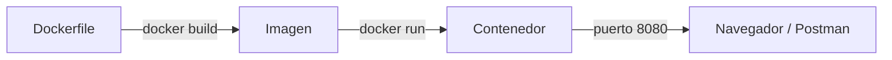

# Dia 15: Docker - Contenedores para Desarrollo

**Curso IFCD0014 -- Semana 4, Dia 15**

---

## Objetivos del dia

- Entender la diferencia entre contenedores y maquinas virtuales
- Instalar Docker Desktop y verificar la instalacion
- Conocer los conceptos fundamentales: imagen, contenedor, registro, Dockerfile
- Crear un Dockerfile multi-stage para una aplicacion Spring Boot
- Construir y ejecutar tu aplicacion como contenedor

## Conceptos clave

Un contenedor es un proceso aislado que incluye tu aplicacion y sus dependencias, pero comparte el kernel del sistema operativo. A diferencia de una VM, no necesita un sistema operativo completo, por lo que arranca en segundos y consume menos recursos. Docker es la herramienta que gestiona estos contenedores.

Una imagen es el "plano" del contenedor (como una clase), y un contenedor es una instancia en ejecucion (como un objeto). Las imagenes se construyen con un `Dockerfile` y se almacenan en registros como Docker Hub. Una imagen de Spring Boot incluye el JDK, el JAR de la aplicacion y la configuracion necesaria.

El Dockerfile multi-stage usa dos etapas: la primera (`build`) compila el proyecto con Maven, la segunda (`runtime`) copia solo el JAR generado sobre una imagen JRE ligera. Esto produce imagenes finales de 200-300 MB en vez de 800+ MB.

## Que vas a construir

Un Dockerfile multi-stage para la Pizzeria Spring Boot (o tu proyecto personal). Construir la imagen con `docker build` y ejecutar la aplicacion como contenedor accesible en localhost:8080.

## Arquitectura sugerida

## Ejercicios

1. Instalar Docker Desktop y verificar con `docker --version` y `docker run hello-world`
2. Escribir un Dockerfile multi-stage: etapa 1 con `maven:3.9-eclipse-temurin-21` para compilar, etapa 2 con `eclipse-temurin:21-jre` para ejecutar
3. Construir la imagen con `docker build -t pizzeria:1.0 .`
4. Ejecutar el contenedor con `docker run -p 8080:8080 pizzeria:1.0` y probar en Swagger
5. Listar imagenes (`docker images`) y contenedores (`docker ps`), detener y eliminar

## Verificacion

- [ ] `docker --version` muestra la version instalada
- [ ] `docker build` construye la imagen sin errores
- [ ] `docker run` inicia la aplicacion y responde en http://localhost:8080
- [ ] `docker images` muestra la imagen con un tamano razonable (< 400 MB)
- [ ] Sabes detener (`docker stop`) y eliminar (`docker rm`, `docker rmi`) contenedores e imagenes

## Profundiza con el libro

El capitulo "Docker para desarrolladores Java" en *Arquitectura de Sistemas Enterprise* de @TodoEconometria explica las capas de una imagen Docker, por que multi-stage es esencial para produccion, y como configurar health checks y variables de entorno en contenedores Spring Boot.

---
Curso IFCD0014 | Prof. Juan Marcelo Gutierrez Miranda | @TodoEconometria
