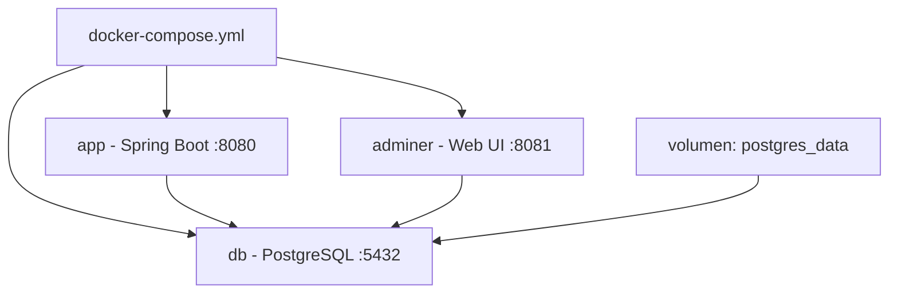

# Dia 16: Docker Compose y PostgreSQL

**Curso IFCD0014 -- Semana 4, Dia 16**

---

## Objetivos del dia

- Entender Docker Compose como orquestador de multiples contenedores
- Migrar la aplicacion de H2 (memoria) a PostgreSQL (contenedor)
- Escribir un `docker-compose.yml` con 3 servicios: app, base de datos y Adminer
- Configurar volumenes para persistir datos y redes para comunicacion
- Gestionar el ciclo de vida con `docker compose up/down`

## Conceptos clave

Docker Compose permite definir y ejecutar aplicaciones multi-contenedor. En un archivo `docker-compose.yml` describes todos los servicios (app, base de datos, herramientas) y sus configuraciones. Un solo comando `docker compose up` levanta todo el stack.

Migrar de H2 a PostgreSQL requiere cambiar la dependencia Maven (de `h2` a `postgresql`), actualizar `application.properties` con la URL, usuario y contrasena de PostgreSQL, y cambiar `hibernate.dialect`. El codigo Java no cambia ni una linea gracias a JPA.

Adminer es un gestor de bases de datos web (alternativa ligera a pgAdmin). Corre como un contenedor mas en el Compose y permite ver las tablas, ejecutar SQL y verificar los datos desde el navegador en http://localhost:8081.

## Que vas a construir

Un stack Docker Compose con tres servicios: tu aplicacion Spring Boot, una base de datos PostgreSQL y Adminer como cliente web. Los datos persisten en un volumen Docker.

## Arquitectura sugerida

## Ejercicios

1. Cambiar la dependencia de H2 a PostgreSQL en el `pom.xml`
2. Actualizar `application.properties` con la configuracion de PostgreSQL (url, username, password, dialect)
3. Escribir `docker-compose.yml` con los servicios `app`, `db` (postgres:16) y `adminer`
4. Configurar un volumen para PostgreSQL y una red interna para la comunicacion entre servicios
5. Ejecutar `docker compose up -d`, verificar en Swagger (8080) y ver las tablas en Adminer (8081)

## Verificacion

- [ ] `docker compose up -d` levanta los 3 contenedores sin errores
- [ ] La aplicacion se conecta a PostgreSQL (no a H2)
- [ ] Adminer en http://localhost:8081 muestra las tablas creadas por Hibernate
- [ ] Los datos persisten despues de `docker compose down` y `docker compose up` (gracias al volumen)
- [ ] `docker compose logs app` muestra los logs de Spring Boot sin errores de conexion

## Profundiza con el libro

El capitulo "Docker Compose y entornos multi-contenedor" en *Arquitectura de Sistemas Enterprise* de @TodoEconometria explica redes Docker, estrategias de volumenes, variables de entorno con archivos `.env`, y como preparar un Compose para produccion.

---
Curso IFCD0014 | Prof. Juan Marcelo Gutierrez Miranda | @TodoEconometria
