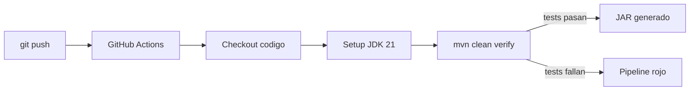

# Dia 17: CI/CD con GitHub Actions

**Curso IFCD0014 -- Semana 4, Dia 17**

---

## Objetivos del dia

- Entender los conceptos de Integracion Continua (CI) y Despliegue Continuo (CD)
- Crear un workflow de GitHub Actions que compile y testee automaticamente
- Configurar triggers, jobs y steps en un archivo YAML
- Automatizar la generacion del JAR en cada push
- Interpretar los resultados de un pipeline (verde/rojo)

## Conceptos clave

Integracion Continua (CI) automatiza la verificacion del codigo cada vez que alguien hace push: compila, ejecuta tests y reporta errores. Despliegue Continuo (CD) extiende esto para desplegar automaticamente a un servidor. Juntos, CI/CD eliminan el "funciona en mi maquina" y garantizan que el codigo del repositorio siempre esta en estado funcional.

GitHub Actions es el sistema CI/CD integrado en GitHub. Un workflow es un archivo YAML en `.github/workflows/` que define que hacer (jobs), cuando hacerlo (triggers: push, pull_request) y donde hacerlo (runners: ubuntu-latest). Cada job tiene steps que ejecutan comandos o acciones predefinidas.

El workflow tipico para Spring Boot: checkout del codigo, setup de JDK 21, ejecutar `mvn clean verify`. Si los tests fallan, el workflow se marca como rojo y bloquea el merge. Esto fuerza la disciplina de mantener los tests actualizados.

## Que vas a construir

Un pipeline CI/CD completo para tu proyecto: un workflow de GitHub Actions que compila con Maven, ejecuta los tests de JUnit 5 y genera el JAR empaquetado, todo automaticamente en cada push.

## Arquitectura sugerida

## Ejercicios

1. Crear la carpeta `.github/workflows/` en tu proyecto
2. Escribir `build.yml` con trigger en push a main, job con ubuntu-latest, JDK 21 y `mvn clean verify`
3. Hacer push y verificar que el workflow se ejecuta en la pestana "Actions" de GitHub
4. Agregar un test que falle intencionalmente, hacer push y ver el pipeline en rojo
5. Corregir el test, hacer push y confirmar que vuelve a verde. Agregar el badge de estado al README

## Verificacion

- [ ] El archivo `.github/workflows/build.yml` existe con la configuracion correcta
- [ ] El workflow se dispara automaticamente en cada push a main
- [ ] El pipeline ejecuta `mvn clean verify` exitosamente (verde)
- [ ] Un test roto hace que el pipeline falle (rojo)
- [ ] El badge de estado en el README refleja el estado actual del build

## Profundiza con el libro

El capitulo "CI/CD para aplicaciones Spring Boot" en *Arquitectura de Sistemas Enterprise* de @TodoEconometria cubre workflows avanzados: matrices de versiones Java, caching de dependencias Maven, despliegue automatizado a Railway/Render, y secretos de GitHub para credenciales.

---
Curso IFCD0014 | Prof. Juan Marcelo Gutierrez Miranda | @TodoEconometria
