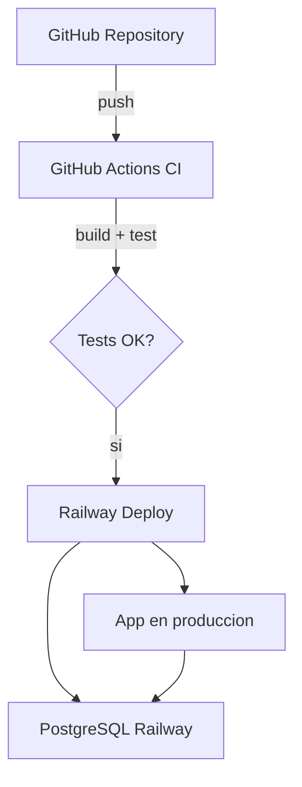

# Dia 18: Deploy a Produccion

**Curso IFCD0014 -- Semana 4, Dia 18**

---

## Objetivos del dia

- Dockerizar el proyecto personal con Dockerfile multi-stage
- Crear docker-compose.yml con app + PostgreSQL + CI/CD
- Escribir un README profesional con badge de build, descripcion y capturas
- Desplegar la aplicacion a Railway (o alternativa cloud)
- Verificar que la API funciona en la URL publica

## Conceptos clave

Dockerizar el proyecto personal aplica todo lo aprendido en los dias 15-17: Dockerfile multi-stage para la imagen, Compose para el stack local (app + PostgreSQL), y GitHub Actions para CI/CD. La diferencia es que ahora lo haces con tu propio proyecto, no con la Pizzeria.

Railway es una plataforma cloud que permite desplegar aplicaciones desde un repositorio de GitHub. Detecta el Dockerfile, construye la imagen y la despliega automaticamente. Para la base de datos, Railway ofrece PostgreSQL como servicio. Las variables de entorno (`DATABASE_URL`, `SPRING_PROFILES_ACTIVE=prod`) se configuran en el dashboard.

Un README profesional es la carta de presentacion del proyecto. Debe incluir: titulo, descripcion del proyecto, badge de CI/CD, tecnologias usadas, instrucciones para ejecutar localmente (con Docker Compose), endpoints de la API, y capturas de Swagger UI.

## Que vas a construir

Tu proyecto personal desplegado en produccion: accesible desde una URL publica, con base de datos PostgreSQL, CI/CD automatizado y un README que cualquier desarrollador pueda seguir para ejecutar el proyecto.

## Arquitectura sugerida

## Ejercicios

1. Crear el Dockerfile multi-stage en la raiz del proyecto personal
2. Crear `docker-compose.yml` con servicios app + postgres + adminer para desarrollo local
3. Crear cuenta en Railway, conectar el repositorio de GitHub y configurar variables de entorno
4. Verificar que la API responde en la URL publica de Railway
5. Escribir el README con: descripcion, badge CI, tecnologias, como ejecutar con Docker, endpoints, capturas de Swagger

## Verificacion

- [ ] `docker compose up` levanta el proyecto localmente sin errores
- [ ] GitHub Actions ejecuta el pipeline en cada push (badge verde)
- [ ] La API esta accesible en la URL publica de Railway
- [ ] Los endpoints responden correctamente en produccion (probar con Postman)
- [ ] El README tiene toda la informacion necesaria para que otro desarrollador entienda y ejecute el proyecto

## Profundiza con el libro

El capitulo "Del desarrollo al deploy" en *Arquitectura de Sistemas Enterprise* de @TodoEconometria cubre perfiles de Spring Boot (dev/prod), gestion de secretos, logs en produccion, monitoreo con Actuator y estrategias de deploy (blue-green, canary).

---
Curso IFCD0014 | Prof. Juan Marcelo Gutierrez Miranda | @TodoEconometria
